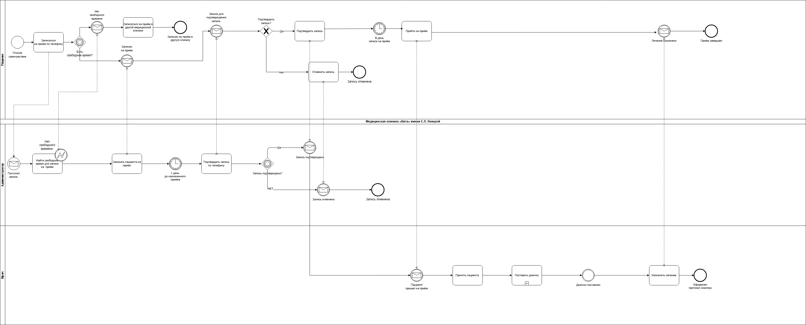
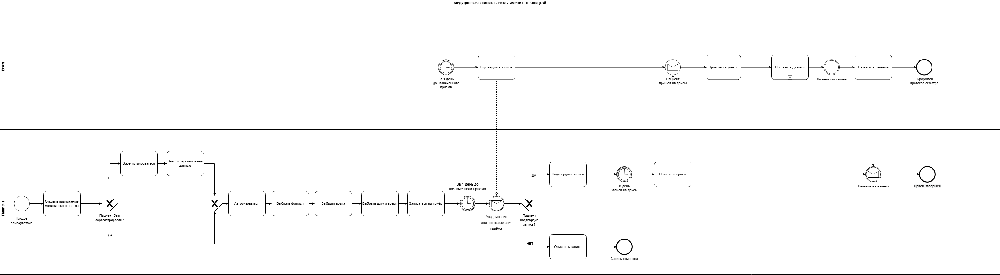
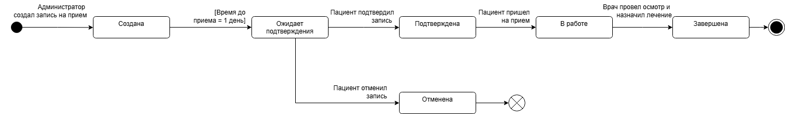

# 🏥 Запись пациента к врачу
 
## Описание проекта

Сеть медицинских клиник «Вита» планирует разработать приложение для пациентов, позволяющее самостоятельно записываться на приём к врачу.

## Цель

Проанализировать текущий процесс записи (AS-IS), выявить проблемы и предложить улучшенный процесс (TO-BE).

## Функционал приложения
- регистрация пациента
- поиск врача
- выбор времени приёма
- запись на приём

## Задачи

- Проаналиировала процесс записи к врачу (AS-IS)
- Построила BPMN-диаграмму AS-IS
- Построила UML-диаграмму состояний
- Разработала улучшенный процесс TO-BE (BPMN)

## AS-IS процесс

Текущий процесс записи осуществляется через администратора филиала:

- В каждом филиале используется электронный календарь
- Доступ к календарю имеют врач и администратор
- Пациент записывается по телефону через администратора
- Администратор создаёт запись и может добавлять комментарии
- При отмене приёма запись удаляется
  
Врач фиксирует:
- начало приёма
- жалобы пациента
- назначенное лечение
- окончание приёма

## Диаграммы

## AS-IS BPMN

## TO-BE BPMN

## UML State Machine

## Результаты
- Выявлены узкие места текущего процесса
- Предложен улучшенный сценарий записи через приложение
- Снижена нагрузка на администраторов
- Значительно упрощен процесс записи для пациентов
  
## Инструменты
- BPMN 2.0
- UML
- Draw.io

